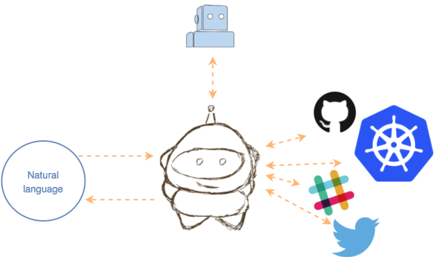

# KuWit

[KuWit.io](http://kuwit.io), the AI bot who knows everything about Kubernetes.

He's built on the shoulders of https://wit.ai/ and is becoming smarter every day by training and using Natural Language Processing.

KuWit relies on Wit for making predictions and extracting entities from natural language and then executes actions and retrieve information from external APIs in order to finally deliver a meaningful user output.

At the moment KuWit has three main functions:

* Teach about Kubernets

* Interact with your Kubernetes cluster.

* Follow the latest news about Kubernetes on the internet.

You can check it out and use it as a service on [KuWit](http://kuwit.io) or just clone it from [https://github.com/capgemini/kuwit](https://github.com/capgemini/kuwit) and customise it and deploy it on your own platform.

# Future plans

* Improve KuWit understanding ability.

* Add ability to communicate with slack and more parties.

* At the moment KuWit runs in a single Docker container. We should be able to provide a PoC providing a serverless solution in a [s3](https://aws.amazon.com/es/s3/) + [lambda](https://aws.amazon.com/documentation/lambda/) style.

# Blog

https://capgemini.github.io/bots/kuwit/
